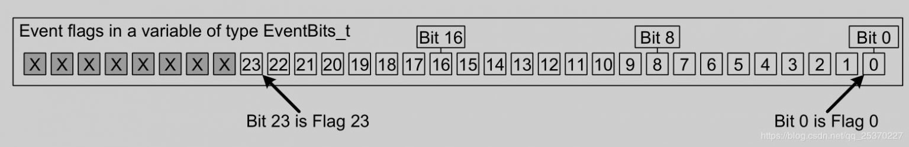

# EVENT GROUP

## Tổng quan

> Cũng như `Semaphore`, `Queue`, `Mutex` thì `Even Group` có thể đưa một task vào trạng thái **Block** cũng như là **Running**. Tuy nhiên, khác ở chỗ là task bị **Block** có thể phải chờ nhiều sự kiện.

## Tại sao lại dùng Event Group

> Các ứng dụng về lập trình nhúng đòi hỏi phải người lập trình phải tối ưu về bộ nhớ. Băng cách sử dụng `Event Group` ta có thể tránh được việc phải sử dụng nhiều `Binary Semaphore`.

## Event Bits (Event Flags)

> `Event Bits` được sử dụng để chỉ định sự kiện đó có hoạt động hay không. `Event Bits` có tên gọi khác là `Event Flags`. Nó mang hai giá trị **_0_** và **_1_**.
> Ví dụ về cách ứng dụng trong lập trình:
> Define một bit (hoặc flag) có nghĩa "một tin nhắn được nhận và sẳn sàng để xử lý" khi nó được đặt thành 1 và "không có tin nhằn nào chờ được xử lý" khi nó được đặt thành 0.

## Event Group

> `Event Group` là một tập hợp các `Event Bits`.
> Kiểu dữ liệu `EventBits_t` được dùng để chứa các `Event Bits` trong một `Event Group`. Còn các `Event Group` có kiểu dữ liệu `EventGroupHandle_t`.
> Số `Event Bit` trong một `Event Group` tùy thuộc vào cấu hình của người lập trình ở **configUSE_16_BIT_TICKS** hoặc **configTICK_TYPE_WIDTH_IN_BITS**:
>
> -   Số bit (hoặc cờ) được triển khai trong một nhóm sự kiện là 8 nếu **configUSE_16_BIT_TICKS** được đặt thành 1 hoặc 24 nếu **configUSE_16_BIT_TICKS** được đặt thành 0.
> -   Số bit (hoặc cờ) được triển khai trong một nhóm sự kiện là 8 nếu **configTICK_TYPE_WIDTH_IN_BITS** được đặt thành **TICK_TYPE_WIDTH_16_BITS** hoặc 24 nếu **configTICK_TYPE_WIDTH_IN_BITS** được đặt thành **TICK_TYPE_WIDTH_32_BITS** hoặc 56 nếu **configTICK_TYPE_WIDTH_IN_BITS** được đặt thành **TICK*TYPE* WIDTH_64_BITS**.
>     

## Những khó khăn khi sử dụng Event Group

> Có hai khó khăn chính trong việc sử dụng `Event Group` trong RTOS:
>
> -   Tránh tạo ra **race condition** trong ứng dụng của người dùng. Việc sử dụng `Event Group` tạo ra **race condition** nếu:
>     -   Không rõ ai sẽ chịu trách nhiệm xóa từng bit (hoặc cờ riêng lẻ).
>     -   Không rõ khi nào sẽ xóa bit.
>     -   Không rõ trạng thái của một bit do có một task khác hoặc một ngắt khác đã thay đổi bit đó trong quá trình chạy chương trình.
> -   Tránh **Non-Determinism**:
>     **Non-Determinism** có nghĩa là không xác định được có bao nhiêu task đang bị **Block** do đó dẫn đến không biết ó bao nhiêu điều kiện để task không bị **Block**.

## API Event Group trong freeRTOS

### Khởi tạo Event Group

```C
    EventGroupHandle_t xEventGroupCreate( void );
```

**Feature**:

-   Tạo một `Event Group` mới.
-   Để sử dụng được chức năng này thì RTOS API phải có: **configSUPPORT_DYNAMIC_ALLOCATION** phải được set là 1 trong `FreeRTOSConfig.h` (hoặc không cần quan tâm mặc định nó sẽ là 1) :).
-   Một `Event Group` được yêu cầu với lượng RAM rất nhỏ để sử dụng. Được phân bổ một cách tự động nếu sử dụng hàm `xEventGroupCreate()` và được có thể tùy biến được nếu sử dụng hàm `xEventGroupCreateStatic()`.
-   Số bit (hoặc cờ) trong một `Event Group` có thể cấu hình (xem lại phần trên) :).
-   Nếu một `Event Group` được tạo thành công thì một `handle` cho `Event Group` được trả về. Nếu không đủ vùng nhớ để tạo một `Event Group` thì giá trị trả về là `NULL`.

**Example**:

```C
    /* Declare a variable to hold the created event group. */
    EventGroupHandle_t xCreatedEventGroup;

    /* Attempt to create the event group. */
    xCreatedEventGroup = xEventGroupCreate();

    /* Was the event group created successfully? */
    if( xCreatedEventGroup == NULL )
    {
        /* The event group was not created because there was insufficient
        FreeRTOS heap available. */
    }
    else
    {
        /* The event group was created. */
    }
```

### Block Task để chờ 1 hoặc nhiều bit được set

```C
 EventBits_t xEventGroupWaitBits(
                       const EventGroupHandle_t xEventGroup,
                       const EventBits_t uxBitsToWaitFor,
                       const BaseType_t xClearOnExit,
                       const BaseType_t xWaitForAllBits,
                       TickType_t xTicksToWait );
```

**Feature**:

-   Đọc các bit của `Event Group` trong RTOS, sẽ được task đang sử dụng hàm này vào trạng thái **Block** (có thời gian chờ - timeout) để đợi một bit hoặc nhiều bit được thiết lập.
-   Không thể gọi này trong ngắt.

**Parameters**:

-   `xEventGroup`: The event group in which the bits are being tested. The event group must have previously been created using a call to xEventGroupCreate().
-   `uxBitsToWaitFor`: A bitwise value that indicates the bit or bits to test inside the event group. For example, to wait for bit 0 and/or bit 2 set `uxBitsToWaitFor` to 0x05. To wait for bits 0 and/or bit 1 and/or bit 2 set `uxBitsToWaitFor` to 0x07. Etc.
    `uxBitsToWaitFor` must not be set to 0.

-   `xClearOnExit`:

    -   If `xClearOnExit` is set to **pdTRUE** then any bits set in the value passed as the `uxBitsToWaitFor` parameter will be cleared in the event group before `xEventGroupWaitBits()` returns if `xEventGroupWaitBits()` returns for any reason other than a timeout. The timeout value is set by the xTicksToWait parameter.
    -   If `xClearOnExit` is set to **pdFALSE** then the bits set in the event group are not altered when the call to `xEventGroupWaitBits()` returns.

-   `xWaitForAllBits`:

    -   `xWaitForAllBits` is used to create either a logical AND test (where all bits must be set) or a logical OR test (where one or more bits must be set) as follows:
    -   If `xWaitForAllBits` is set to **pdTRUE** then `xEventGroupWaitBits()` will return when either all the bits set in the value passed as the `uxBitsToWaitFor` parameter are set in the event group or the specified block time expires.

    -   If `xWaitForAllBits` is set to **pdFALSE** then `xEventGroupWaitBits()` will return when any of the bits set in the value passed as the `uxBitsToWaitFor` parameter are set in the event group or the specified block time expires.

-   `xTicksToWait`: The maximum amount of time (specified in 'ticks') to wait for one/all (depending on the `xWaitForAllBits` value) of the bits specified by `uxBitsToWaitFor` to become set.

**Returns**:

-   The value of the event group at the time either the event bits being waited for became set, or the block time expired. The current value of the event bits in an event group will be different to the returned value if a higher priority task or interrupt changed the value of an event bit between the calling task leaving the Blocked state and exiting the `xEventGroupWaitBits()` function.
-   Test the return value to know which bits were set. If `xEventGroupWaitBits()` returned because its timeout expired then not all the bits being waited for will be set. If `xEventGroupWaitBits()` returned because the bits it was waiting for were set then the returned value is the event group value before any bits were automatically cleared because the xClearOnExit parameter was set to **pdTRUE**.

**Example**:

```C
#define BIT_0	( 1 << 0 )
#define BIT_4	( 1 << 4 )

void aFunction( EventGroupHandle_t xEventGroup )
{
EventBits_t uxBits;
const TickType_t xTicksToWait = 100 / portTICK_PERIOD_MS;

  /* Wait a maximum of 100ms for either bit 0 or bit 4 to be set within
  the event group.  Clear the bits before exiting. */
  uxBits = xEventGroupWaitBits(
            xEventGroup,   /* The event group being tested. */
            BIT_0 | BIT_4, /* The bits within the event group to wait for. */
            pdTRUE,        /* BIT_0 & BIT_4 should be cleared before returning. */
            pdFALSE,       /* Don't wait for both bits, either bit will do. */
            xTicksToWait );/* Wait a maximum of 100ms for either bit to be set. */

  if( ( uxBits & ( BIT_0 | BIT_4 ) ) == ( BIT_0 | BIT_4 ) )
  {
      /* xEventGroupWaitBits() returned because both bits were set. */
  }
  else if( ( uxBits & BIT_0 ) != 0 )
  {
      /* xEventGroupWaitBits() returned because just BIT_0 was set. */
  }
  else if( ( uxBits & BIT_4 ) != 0 )
  {
      /* xEventGroupWaitBits() returned because just BIT_4 was set. */
  }
  else
  {
      /* xEventGroupWaitBits() returned because xTicksToWait ticks passed
      without either BIT_0 or BIT_4 becoming set. */
  }
}
```

### Set bits trong Event Group

```C
 EventBits_t xEventGroupSetBits( EventGroupHandle_t xEventGroup,
                                 const EventBits_t uxBitsToSet );
```

## Tham Khảo
> [freeRTOS - EventGroup](https://www.freertos.org/event-groups-API.html)